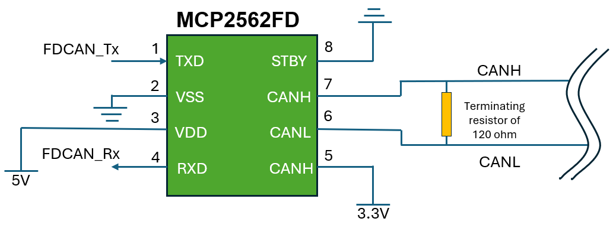
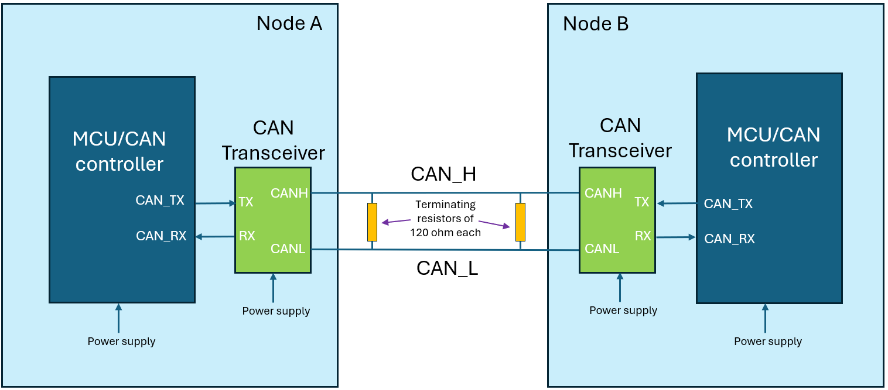

# FDCAN example at 8Mb/s on several platforms

## Summary

The purpose of this example is to show that STM32 FDCAN can reach 8Mb/s during the data phase.

## Hardware

This example is provided for the following platforms and can be tailored for any other STM32 platform, provided the MCU features an FDCAN interface:
* NUCLEO-G0B1 (STM32G0B1RE)
* NUCLEO-G474 (STM32G474RE)
* NUCLEO-H563 (STM32H563ZI)
* NUCLEO-H753 (STM32H753ZI)
* NUCLEO-L552 (STM32L552ZE)
* NUCLEO-U575 (STM32U575ZI)

The transceiver used to run the example is **MCP2562FD** for each node (board).

### Transceiver schematics:

## How to use this example

Build the project corresponding to your STM32 board, then load the generated image into memory. You need to connect two nodes (boards) as shown below:

Each time the user button of one node is pressed, a FDCAN frame is transmitted to the other node, causing its LED to toggle once.

## Additional resources

Please refer to [this](https://community.st.com/t5/stm32-mcus/stm32-fdcan-running-at-8-mb-s-on-nucleo-boards/ta-p/730281) article for the timing configuration and the hardware setup to correctly run this example on a specific platform.

## Troubleshooting

Please refer to the [CONTRIBUTING.md](CONTRIBUTING.md) guide.
